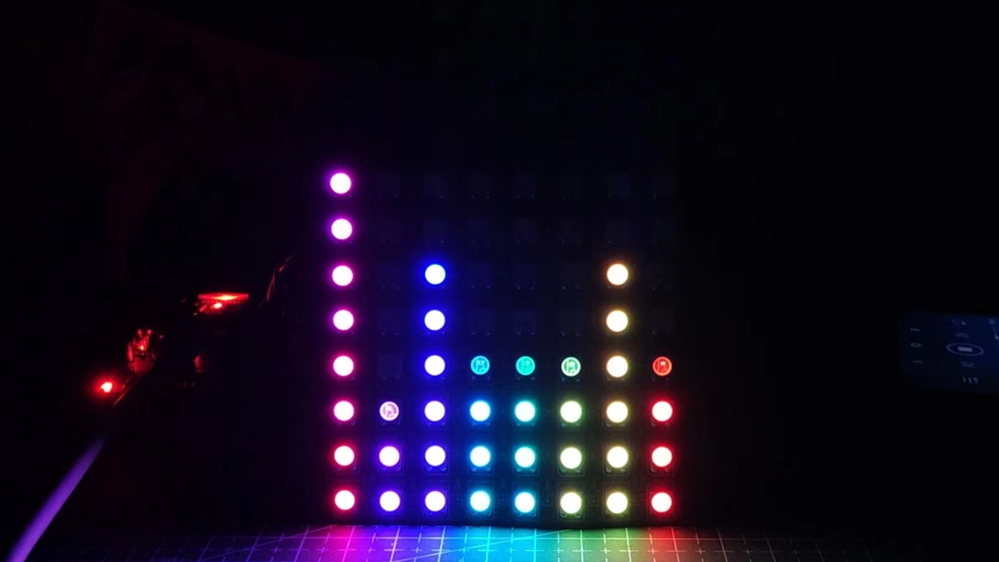
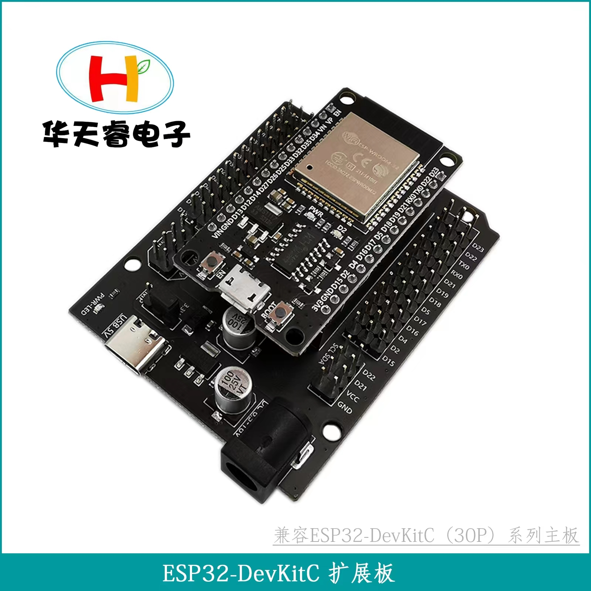
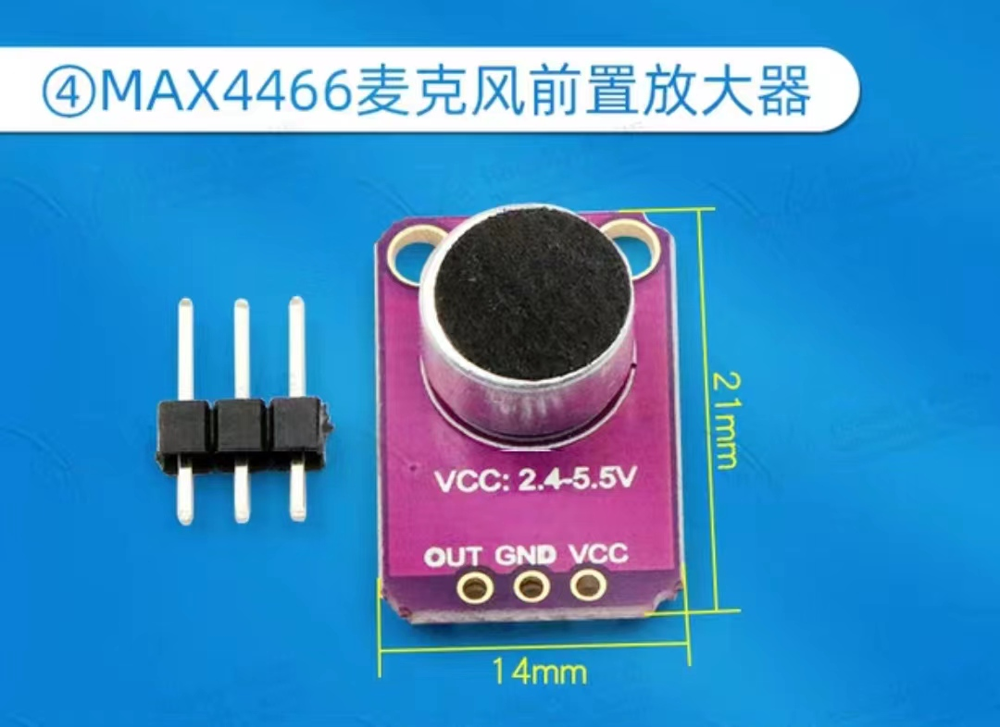
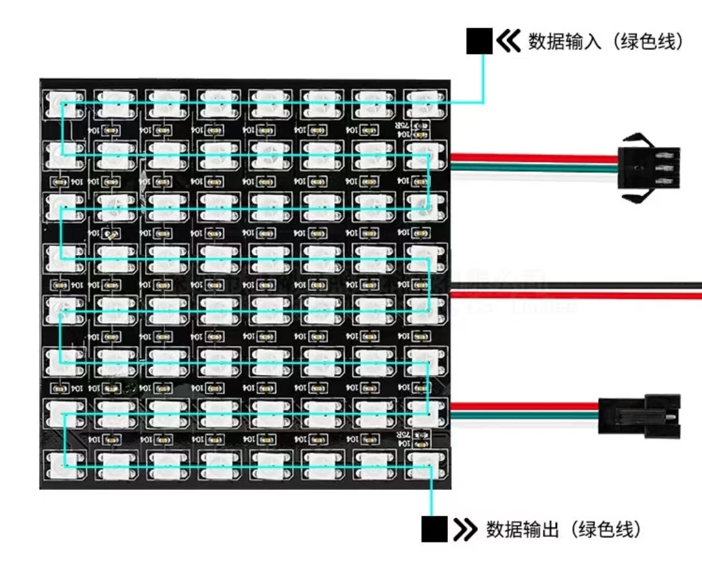
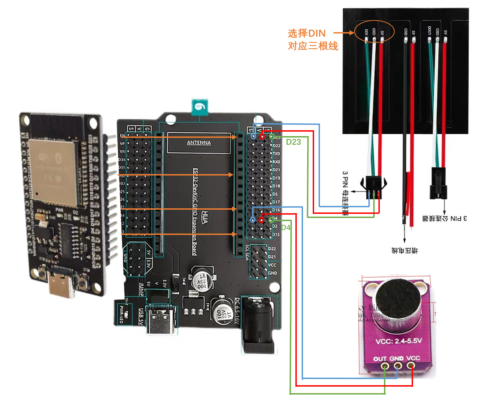
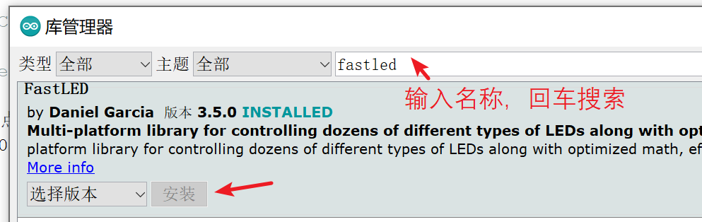
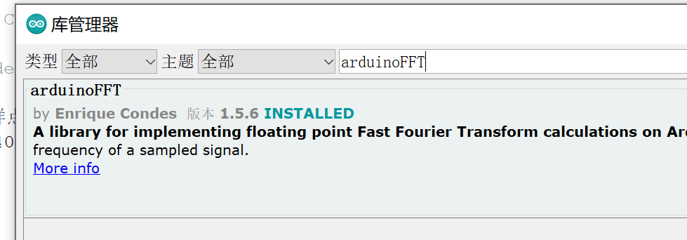
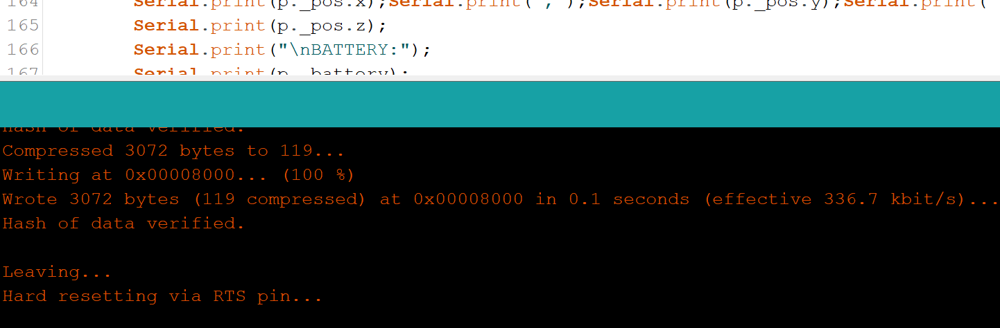
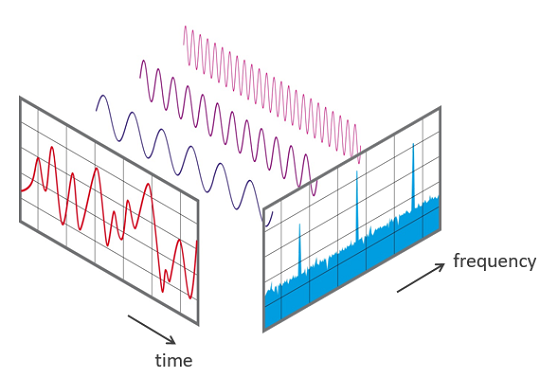

# LEDSpectrum-ESP32音乐频谱灯
## 一、整体介绍

* 组装演示视频：
* 开源链接
    * GitHub仓库：[Fudan-EGA/LEDSpectrum](https://github.com/Fudan-EGA/LEDSpectrum)
    * 国内仓库访问：
  
使用E**SP32开发板**作为主控制器，64个单线串联RGB**彩色灯板**，**麦克风**采集声音，根据不同节奏和音高显示在RGB灯板上，形成炫酷的彩虹律动灯光效果。

采用模块电路搭建的方式，连接方式很简单，无需自己制作电路板即可实现功能，并且方便后面自行添加其他功能。\
 
 

## 二、电路搭建

### 1. 购买清单和链接

* ESP32开发板  [https://m.tb.cn/h.fwVQ4Ek?tk=Kidt2pXJR1L](https://m.tb.cn/h.fwVQ4Ek?tk=Kidt2pXJR1L) 
- 灯板ws2812b RGB屏8x8点阵 [https://m.tb.cn/h.fwVQ4Ek?tk=Kidt2pXJR1L](https://m.tb.cn/h.fwVQ4Ek?tk=Kidt2pXJR1L)
* 麦克风MAX4466  [https://m.tb.cn/h.fEgPlFB?tk=4eN42pXJJN4](https://m.tb.cn/h.fEgPlFB?tk=4eN42pXJJN4)
  **注意**：该麦克风模块排针没有焊接，需要**自行焊接**（只有三个点，焊接非常简单）
- 公对母+母对母杜邦线 [https://m.tb.cn/h.fE9hgap?tk=GFwX2pSC4Lj](https://m.tb.cn/h.fE9hgap?tk=GFwX2pSC4Lj)


    入门级电烙铁推荐购买：[https://m.tb.cn/h.fDhTaXj?tk=Wunk2pSxYYK](https://m.tb.cn/h.fDhTaXj?tk=Wunk2pSxYYK)


* **一键下单**： [https://m.tb.cn/h.fDhTWez](https://m.tb.cn/h.fDhTWez) 手机淘宝打开，购物车打包链接，含以上全部商品，型号已经选好，直接购买即可

### 2. 模块功能介绍
* **ESP32开发板+拓展板：**\
   \

  开发板型号：ESP32-DevKitC WROOM-32
> 使用ESP32开发板作为控制芯片，处理麦克风采集的数据，然后驱动屏幕显示不同内容，由于开发板引出来的供电端口比较少，所以用了一块拓展底板，可以外接很多模块而不用担心供电问题。

* **麦克风：**\
   \
型号：MAX4466

>连接电源VCC和接地端口GND，OUT端口将采集到的音频转化为电压信号，ESP32采集该电压信号再进行处理，具体的信号处理方法将在后面程序部分介绍。

* **灯板**\
   \
  驱动芯片型号：WS2811

>每个灯珠内置驱动芯片，可发出256种彩色光，只需要一根数据线将灯珠前后串联起来，然后通过第一个灯珠输入端口进行控制，即可实现所有灯珠的控制。

* **电路连接**
>  ESP32排针对齐插在拓展板上（注意方向：二者TypeC接口朝向相同）。


>  使用三根母对母杜邦线连接麦克风（需要焊接好排针），OUT口连接拓展板的IO口序号为4，旁边的电源和接地分别对应连接。
  
>  灯板DIN接口对应拓展板IO序号为23，使用3根公对母杜邦线连接，连接之后如图所示。
> 


**供电**：需要使用一根Type-C连接到ESP32开发板（直接插在上面ESP32的Type-C接口，而非拓展板），用来供电和下载程序。

## 三、烧录程序

### 准备工作
* 电路连接完毕的开发板和模块
* 电脑已装好Arduino软件并导入ESP32软件包
* 电脑已装好CH340串口驱动
* 一根TypeC数据线
>Arduino软件下载和使用方式请查看石墨在线文档[《ESP32使用指南（更新中）》](https://shimo.im/docs/5xkGMDrDR2udlM3X/) ,其中第二部分介绍了Arduino软件的下载，第四部分介绍了CH340驱动安装方式，可以按里面的操作下载程序，测试开发板的连接情况。

### 代码和库文件下载


  代码见最开始提供的[GitHub仓库](https://github.com/Fudan-EGA/LEDSpectrum)，若访问有困难可点击国内仓库下载。下载完毕后打开Arduino软件，再点击**文件-打开，**选择下载的代码打开即可。此时点击编译上传将会报错，提示没有库文件，还需要下载对应的库，一共两个：“**FastLED**”和“**arduinoFFT**”库，前一个用来点亮灯板，后一个用来处理采集的音频数据。具体用法将在后面进行解读。
  
- **下载库文件**
  按[《使用指南》](https://shimo.im/docs/5xkGMDrDR2udlM3X/)中提供的下载库文件的方法，点击**项目-加载库-管理库**，再搜索上述库名称并下载，安装完成后如下图：\
   \
   \


* **上传代码到开发板**
确保**开发板**和**串口COM序号**选择正确，然后点击上传按钮 \
 

    等待一会儿，第一次编译所需时间会比较长（实际Arduino编译都很慢），出现以下信息则说明编译成功，可以测试一下麦克风看灯板有没有反应，若软硬件都连接无误，灯板将随声音变化闪烁律动。
 

### 错误排查
- 开发板通电，红色LED不亮：电源连接错误，检查数据线和开发板是否损坏
- 编译错误：确保两个库文件下载完成
- 无法下载程序：
  - 确保CH340驱动安装完成，（完成标志：连接开发板后设备管理中能找到COM端口序号）
  - Arduino内选择好对应端口和开发板

## 四、代码解读

接下来从程序部分简单介绍一下频谱灯的效果是怎样实现的，这部分内容是给想要了解具体实现或者想要拓展功能的朋友提供的。

### 用到的库函数介绍
[LED_Spectrum.ino](https://github.com/Fudan-EGA/LEDSpectrum/blob/master/LED_Spectrum/LED_Spectrum.ino)程序共用到了两个库，已通过上述步骤下载完成，在管理库界面点击“info”可进入他们对应的GitHub开源仓库，里面包含了基本用法和示例程序，可参考学习。接下来进行简单的介绍。

* **FastLED库**
>开源链接：https://github.com/FastLED/FastLED\
>参考教程：[arduino学习——WS2812灯带](https://blog.csdn.net/weixin_51396863/article/details/119572400?ops_request_misc=%257B%2522request%255Fid%2522%253A%2522165605764516780366534612%2522%252C%2522scm%2522%253A%252220140713.130102334.pc%255Fall.%2522%257D&request_id=165605764516780366534612&biz_id=0&utm_medium=distribute.pc_search_result.none-task-blog-2~all~first_rank_ecpm_v1~pc_rank_34-3-119572400-null-null.142^v21^pc_rank_34,157^v15^new_3&utm_term=CHSV&spm=1018.2226.3001.4187)

这个库主要用来驱动显示各类LED灯带或点阵屏，**使用时**需要先**定义**自己使用的LED内置芯片的型号、灯珠数量、色彩类型等，比如我们这里使用的WS2812，数量为64，色彩顺序定义为GRB，见程序开始部分的宏定义。

初始化完成，便可以调用这个库提供的一些函数，实现一些基础操作，点亮一颗灯、点亮一排灯、点一排彩色灯等等，代码例如：

```c++
leds[i] = CRGB::Red; //设置第i个led为红色
fill_rainbow(leds, 30/*数量*/, beginHue/*开始色值*/, deltaHue/*递增值*/)； //设置彩虹渐变
```
本作品代码仓库的examples文件夹提供了一些例子供大家参考。
* **arduinoFFT库**
> **FFT介绍**
> FFT指快速傅里叶变换（Fast Fourier Transform），傅里叶变换是信号处理的基础理论，它将一段信号视为不同频率信号的叠加，通过傅里叶变换能够将时间信号转变为按频率分布的信号。FFT则是拓展的傅里叶变换，顾名思义，运算速度很快，常用在计算机进行数字信号的处理。\
 

> **声音的FFT处理**
声音的频率可以简单理解成音高，高音频率较高，低音则反之。从本作品的角度来讲，FFT所做的工作是：取一段时间内的声音信号作为输入，计算得到这段音频的频率分布情况。如果听起来主要是低音，则频率低的部分幅度就高，高频幅度较低，高音反之。按照幅度区别，通过不同幅度分布就能分辨出一段音乐中的低音鼓点和高音人声。

**arduinoFFT库的使用**
>开源链接：https://github.com/kosme/arduinoFFT

需要先进行参数的定义，包括采样率（采样率越大，音频采样速度越快）、采样点数量（一次采样中采样的点数）、其他运算参数等等。运算时输入时间采样序列值，然后将计算得到输出值，即频率幅度序列。


### 完整代码流程分析

一个流程需要完成的工作：
`读取麦克风电压数据` $->$ `FFT处理数据` $->$ `根据处理结果点亮灯板` 

在Arduino运行框架下将运行两个函数：

`setup函数：`只运行一次，执行模块的初始化代码。

`loop函数：`循环运行，每次循环都执行以下操作：
* 通过analogRead函数，读取麦克风接口的电压值序列，作为采样的音频信号。
* 输入电压值序列vReal[]，计算得到频率幅度输出序列vImag[]。
* 将输出序列的幅度转换到0-8范围，作为每一列点亮的LED个数。实际输出序列有64个幅度值，而灯板仅有8列，因此计算了相邻几个数的平均值，并间隔式选取。
* 下落效果实现：下一次幅度值大于当前，则更新，否则幅值递减，表现在灯板则为下落效果。
  
>具体的代码编写请参照文件查看，已添加详细注释。

